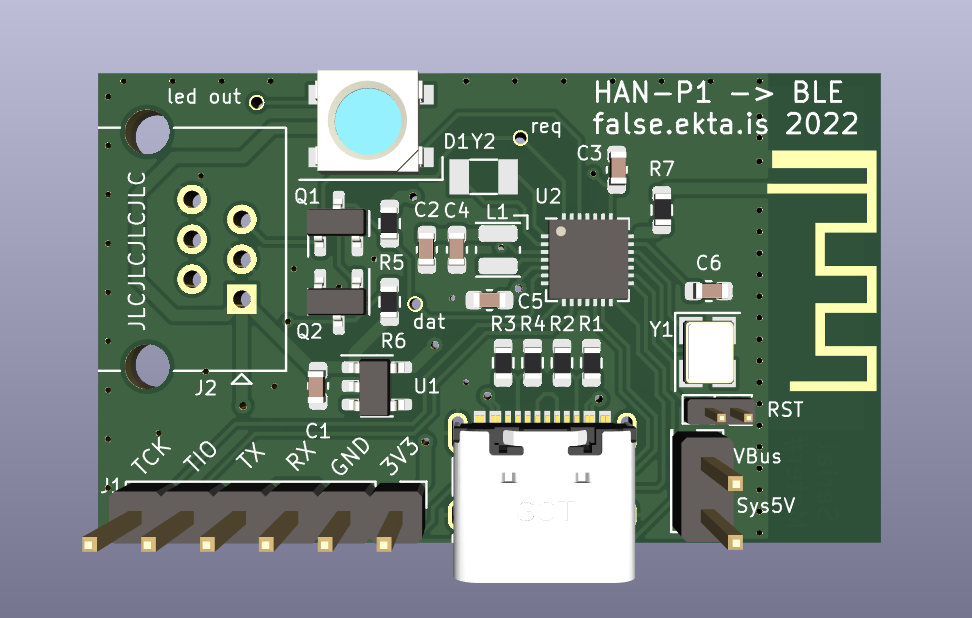

## P1 HAN port to BLE

Nothing fancy, a euro HAN P1 port from an electricity meter to BLE.
Includes a ws2812 style LED for local indication, and a header for debug and programming.
Nothing else at all really, total BOM is ~$2.  You'll need to add your own RJ12/6P6C cable,
and have BLE range.

intention is to re-use something that already exists in homeassistant protocol wise...

## Sample
### 2022-10 revision
Adds USB, parts replaced to match JLCPCB production.

### Initial revision (conflicting pin definitions, overly simplistic)

